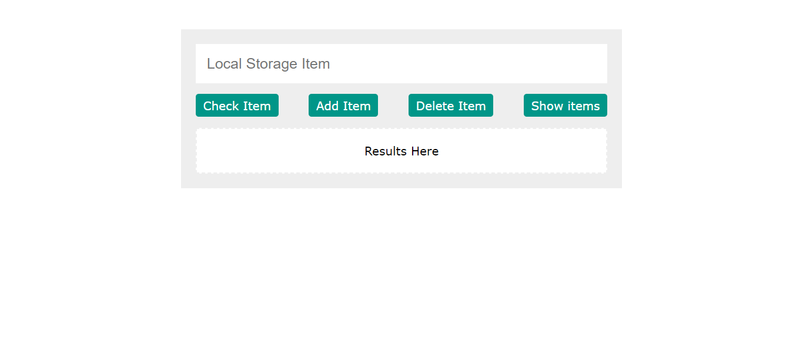

# Project Title

       Mini-app to Control Local Stroage Enteries

## Description

To Control Local Storage Enteries, following tutorials from "Elzero Web School" on YT by Osama Elzero

## Features

- add and remove multiple enteries to local storage.
- option to remove separate entery.
- option to show items save to local storage.

## Technologies Used

- HTML
- CSS
- JavaScript

## Demo

[View Demo on Awesome Screenshot]
"https://www.awesomescreenshot.com/video/34313202?key=b8790bfcc50b1b639f1e8f55e9366471"

## Screenshots

Screenshots are avaialable in the `Screenshots` folder.
Here's an example:

## How to Use

1. Clone the repository.
2. Open `index.html` in your browser to view the project.
