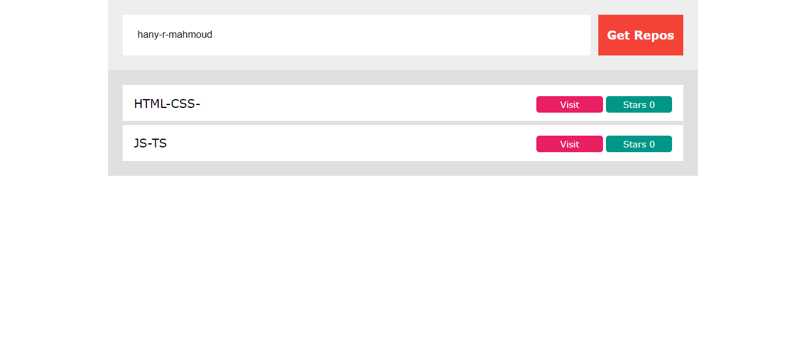

# Project Title

       Mini-app to Fetch Repositories from GitHub

## Description

To Fetch Repositories from GitHub, optional visiting them, following tutorials from "Elzero Web School" on YT by Osama Elzero

## Features

- fetch GitHub repositories by username.
- shows different repositories with link to each respository.
- shows given stars to each repository.

## Technologies Used

- HTML
- CSS / SASS
- JavaScript

## Demo

[View Demo on Awesome Screenshot]

[![Video Demo]"https://www.awesomescreenshot.com/video/34313579?key=417cdf9327f6a105d41ec779dec03ced"

## Screenshots

Screenshots are avaialable in the `Screenshots` folder.
Here's an example:

## How to Use

1. Clone the repository.
2. Open `index.html` in your browser to view the project.
