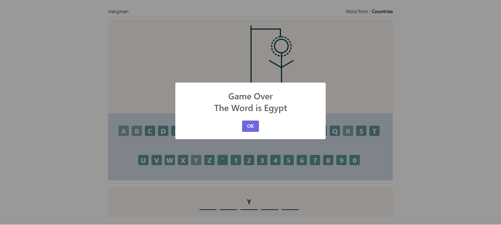

# Project Title

        Hangman game

## Description

A game for guessing words, following tutorials from "Elzero Web School" on YT by Osama Elzero

## Features

- interactive game of guessing words.
- multiple categories, with different words in each category.

## Technologies Used

- HTML
- CSS / SASS
- JavaScript

## Demo

[View Demo on Awesome Screenshot]
"https://www.awesomescreenshot.com/video/34457882?key=c872a339640f8a4dd967e2226fbb1ef2"

## Screenshots

Screenshots are avaialable in the `Screenshots` folder.
Here's an example:

## How to Use

1. Clone the repository.
2. Open `index.html` in your browser to view the project.
