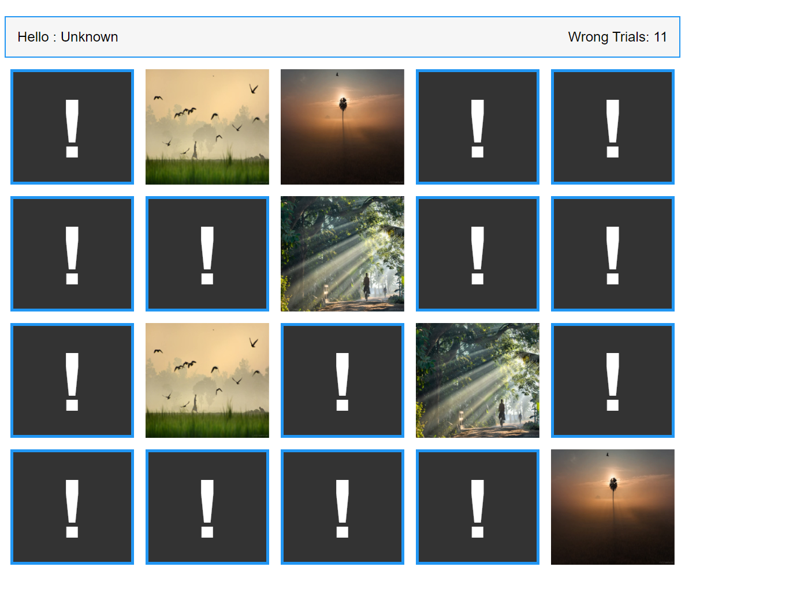

# Project Title

        Memory Block Game

## Description

A Memory Game, following tutorials from "Elzero Web School" on YT by Osama Elzero

## Features

- interactive memory game with multiple blocks.
- counting trial times to finish all.
- random card poisitions with each refresh.

## Technologies Used

- HTML
- CSS / SASS
- JavaScript

## Demo

[View Demo on Awesome Screenshot]
"https://www.awesomescreenshot.com/video/34457337?key=40ca9587179b07ab7f47d773faec7b2a"

## Screenshots

Screenshots are avaialable in the `Screenshots` folder.
Here's an example:

## How to Use

1. Clone the repository.
2. Open `index.html` in your browser to view the project.
