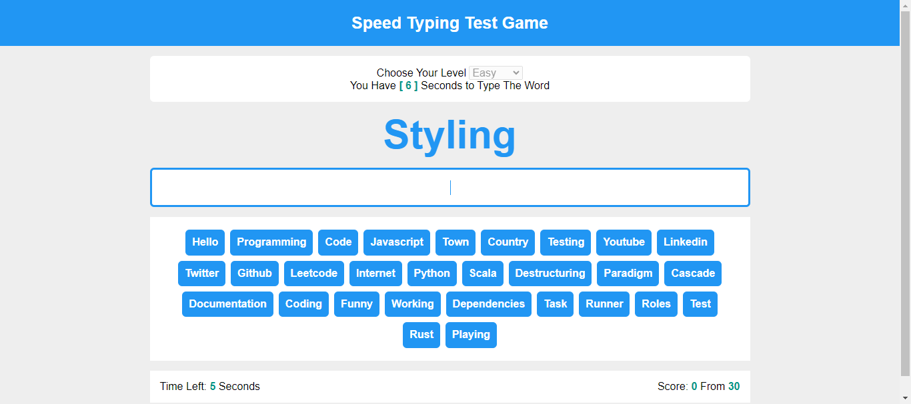

# Project Title

    	Speed Typing Game Model

## Description

A game to test speed typing, following tutorials from "Elzero Web School" on YT by Osama Elzero

## Features

- 3 Levels of Difficulties ( Easy , Medium, Hard).
- Each level has different time limit to type the word.
- Potential to add any number of words and any varities.
-

## Technologies Used

- HTML
- CSS / SASS
- JavaScript

## Demo

[View Demo on Awesome Screenshot]
"https://www.awesomescreenshot.com/video/34312550?key=a93f43bb44a7954d9b00bfd95710d3a0"

## Screenshots

Screenshots are avaialable in the `Screenshots` folder.
Here's an example:

## How to Use

1. Clone the repository.
2. Open `index.html` in your browser to view the project.
