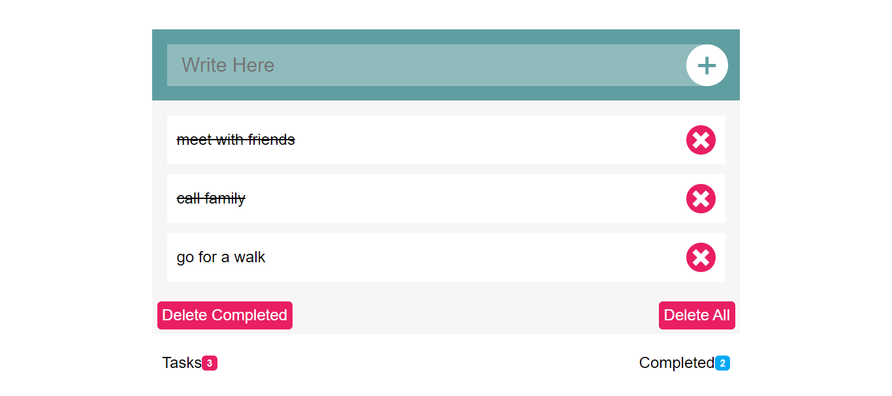

# Project Title

       To-Do List Model

## Description

A To-Do List, following tutorials from "Elzero Web School" on YT by Osama Elzero

## Features

- add and remove multiple tasks.
- option to remove separate tasks.
- option to remove completed tasks only.
- option to remove all tasks.

## Technologies Used

- HTML
- CSS / SASS
- JavaScript

## Demo

[View Demo on Awesome Screenshot]
"https://www.awesomescreenshot.com/video/34312822?key=aaec781b7fbf213f4fa76b60ac55d5e8"

## Screenshots

Screenshots are avaialable in the `Screenshots` folder.
Here's an example:

## How to Use

1. Clone the repository.
2. Open `index.html` in your browser to view the project.
