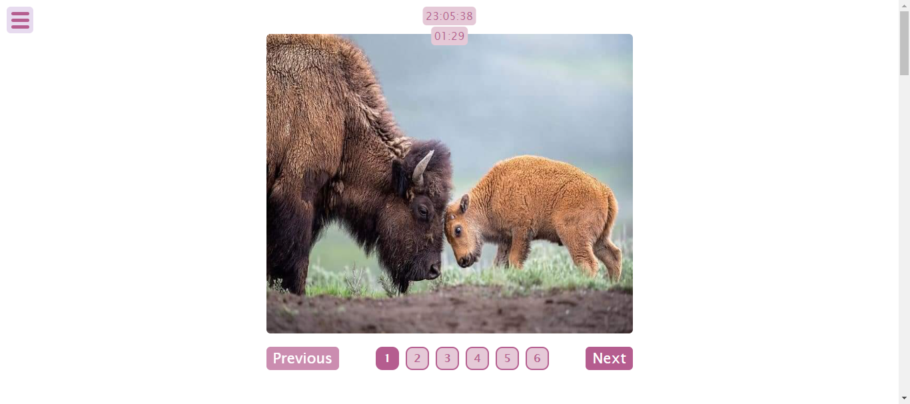

# Project Title				
		JS/TS Tutorials 1		
## Description				
A collection of mini tutorials , using TypeScript and JavaScript				
				
## Features				
- Image Album Slider
- Random Change background image
- Countdown Timer
- Simple Dynamic Clock
- Scroll to Top Button
- Progress Bar on Scroll
- Input Field Count Charachters on typing
- Show/Hide Password
- Animate Bar Width on Scrolling
- Increasing Numbers on Scrolling
- FullScreen Navigation X-Button
- Tabs with Different Sections
- 			
				
## Technologies Used				
- HTML				
- CSS / SASS	
- TypeScript / JavaScript			
				
## Demo 
[View Demo on Awesome Screenshot]
"https://www.awesomescreenshot.com/video/34311640?key=a3c08f132b557ba2ac5f80f63d2a0a7b"			
				
## Screenshots				
Screenshots are avaialable in the `Screenshots` folder.
Here's an example:
 				
				
## How to Use				
1. Clone the repository.				
2. Open `index.html` in your browser to view the project.				
				
				
